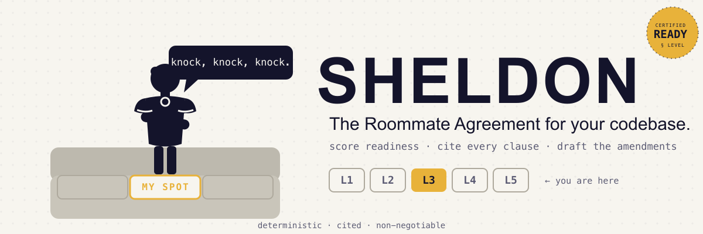

<p align="center">
  
</p>

# Sheldon

**The Roommate Agreement for your codebase — so your agents and your team play by the same rules.**

Your codebase just got new roommates: AI agents. Without an agreement, chaos. Sheldon reads your repo,
assigns it a readiness **Level (1–5)**, cites the evidence for every clause, and drafts the **amendments**
to get you to the next level. Deterministic. Non-negotiable. Occasionally smug.

> *knock knock knock. Your readiness. knock knock knock. Your readiness.*

## What Sheldon actually does

Two agent skills over one pure-stdlib Python engine:

- **`sheldon-report`** — produces a reproducible Level score across 7 pillars (Style & Validation, Build
  System, Testing, Documentation, Dev Environment, Security & Governance, Task Discovery). Every verdict
  cites the file, commit, or GitHub setting that justifies it.
- **`sheldon-fix`** — drafts the Amendments: writes the safe config scaffolds that are simply *missing*,
  proposes documentation for your review, and lists the GitHub settings to change — all on a local branch,
  never pushed.

Sheldon doesn't write your features. He makes the apartment liveable for agents.

## Why Sheldon and not the others

| | file-existence tools | Factory (SaaS) | **Sheldon** |
|---|---|---|---|
| Verification | `ls` heuristics | grounded LLM (opaque) | real: semantic config parse + git + **GitHub API** |
| The score | — | server-side | **deterministic & reproducible**, every clause cited |
| The LLM's role | optional | authoritative | **advisory only** — it explains the Agreement, never rewrites it |
| Remediation | none | PR | **safe scaffolds + drafts**, local branch, never pushes |
| Where it lives | npm | upload your code | **local & open** — the Agreement is yours |

The split *is* the point: a pure-stdlib engine owns the deterministic score (identical in CI and on your
machine); Sheldon (the agent) adds non-gating advisory — and is contractually forbidden from inflating it.

## Move in

The skills follow the [agentskills.io](https://agentskills.io) standard and carry the `agent-skills` topic:

```bash
gh skill install getsheldon/sheldon          # GitHub CLI
npx skills add getsheldon/sheldon            # skills.sh
gemini skills install getsheldon/sheldon     # Gemini CLI
# or add the plugin in Claude Code
```

No runtime dependencies — **Python 3.11+** (and an authenticated `gh` unlocks the GitHub clauses).

## Review the Agreement

```bash
sheldon report --project .                    # the Agreement (Level + cited clauses)
sheldon report --project . --format markdown,json --out .agents/readiness
sheldon fix --project .                       # dry-run: what the Amendments would change
sheldon fix --project . --apply               # write safe scaffolds to a local branch
```

(Or, through an agent: *"run a readiness report on this repo."*)

## The Rungs

Levels **1 Functional → 2 Documented → 3 Standardized → 4 Optimized → 5 Autonomous**. A rung is yours when
≥80% of its clauses pass *and* every rung below it is satisfied. Clauses that don't apply to your project
are `skipped` (visibly, with a reason); when Sheldon can't determine the project type he says `unknown`
rather than waving it through. *(Sheldon scores his own repo at Level 3. He is working on Level 4. He has a flowchart.)*

## House rules at the door (CI)

```yaml
# .github/workflows/readiness.yml
jobs:
  readiness:
    runs-on: ubuntu-latest
    steps:
      - uses: actions/checkout@v4
      - uses: getsheldon/sheldon/ci@v1
        with: { min-level: "3", formats: "markdown,junit,sarif,github" }
        env: { GH_TOKEN: "${{ github.token }}" }
```

SARIF → Security tab, JUnit → test UIs, Markdown → the step summary, and a non-zero exit below your minimum
level. The Agreement is enforced at the door.

## Reference

- [Brand guide](BRAND.md) · [Getting started](docs/getting-started.md) · [CLI](docs/cli.md) · [Extending the clauses](docs/extending.md) · [Contributing](CONTRIBUTING.md)

## License

MIT — see [LICENSE](LICENSE). *Sheldon* is a product name; this project uses no character likeness, series
name, or trademarked catchphrase — only an original archetype and original copy.
