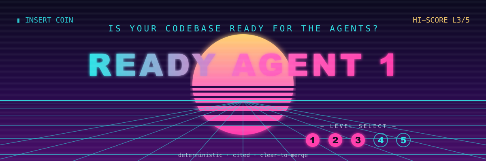

<p align="center">
  
</p>

# Ready Agent 1

**Is your codebase ready for the agents? Score it, clear the defined gates, level up.**

The agent era booted up and your repo is the world they have to play in. Ready Agent 1 scans your repo,
assigns a deterministic readiness **Level (1–4)**, cites the evidence for every check, and hands you
the **loadout** to reach the next level. **Level 5 — Autonomous is reserved**: nothing awards it today.
Deterministic. Reproducible. No continues required.

> **READY?**  Player One has logged in. Brace for impact.

## What Ready Agent 1 does

Three agent skills over one pure-stdlib Python engine:

- **`ra1-report`** — the Readiness Scan: a reproducible Level score across 9 pillars (Style & Validation,
  Build System, Testing, Documentation, Dev Environment, Security & Governance, Task Discovery,
  Observability, Product & Experimentation). Every check cites the file, commit, or GitHub setting that
  justifies it, with a deterministic decision trace.
- **`ra1-fix`** — the Loadout: writes the safe config scaffolds that are simply *missing*, proposes
  documentation for your review, and lists the GitHub settings to change — on a local branch, never pushed.
  Every apply is verified: fresh baseline → safe create-only mutation → same-option rescan → comparable
  regression decision. There is no `--force`, no bypass, and no claim of success without verification.
- **`ra1-interview`** — the questions the scan cannot answer itself: when a criterion is `unknown`
  because the project type is ambiguous, a value only your team can decide is missing, or a data
  source was unreachable, this interviews you one question at a time and records each typed answer
  through the engine. Answers supply inputs the engine re-evaluates; they never mark a check passing.

Ready Agent 1 doesn't play the game for you (it won't write your features). It makes sure the level is beatable.

## Evidence tiers

| Layer | What this release can prove | What it cannot prove |
|---|---|---|
| Repository (T0/T1) | versioned file/config syntax, workflow-wiring shape, git history | platform parser acceptance, effective enforcement, trigger reachability, successful runs |
| GitHub.com (T2) | selected readable API settings (offline by default; opt in with `--github`) | unreadable/enterprise settings, runtime identity, continuous enforcement |
| Execution (T3) | opted-in allowlisted commands in an isolated copy (CLI-only, `--exec`) | a general OS/network sandbox |
| Agent judgment (T4) | advisory analysis clearly separated from the score | deterministic gate satisfaction |

## Why Ready Agent 1, not the others

| | file-existence tools | Factory (SaaS) | **Ready Agent 1** |
|---|---|---|---|
| Verification | `ls` heuristics | grounded LLM (opaque) | real: semantic config parse + git + **GitHub API** |
| The score | — | server-side | **deterministic & reproducible**, every check cited |
| The LLM's role | optional | authoritative | **advisory only** — it coaches; it can't change the score |
| Remediation | none | PR | **safe scaffolds + drafts**, local branch, never pushes |
| Where it runs | npm | upload your code | **local & open** — the save file is yours |

The split *is* the point: a pure-stdlib engine owns the deterministic score (identical in CI and on your
machine); the agent adds non-gating advisory — and is contractually forbidden from inflating it.

## Supported platforms

Linux and macOS hosts whose Python exposes the full POSIX directory-fd/no-follow capability set.
Windows and deficient runtimes fail closed with an exact `safe_io_unsupported` diagnostic before any
repository access — help, `version`, `formats`, and `banner` remain available. T2 GitHub checks target
**GitHub.com only**; GitHub Enterprise is not supported.

## Insert coin

The skills follow the [agentskills.io](https://agentskills.io) standard and carry the `agent-skills` topic:

```bash
gh skill install tjboudreaux/ready-agent-1 ra1-report          # GitHub CLI ≥ 2.90; also ra1-fix, ra1-interview
npx skills add tjboudreaux/ready-agent-1                        # skills.sh — select the ra1-* skills
gemini skills install https://github.com/tjboudreaux/ready-agent-1.git --path skills/ra1-report   # Gemini CLI, one per skill
```

In Claude Code, the repository is its own plugin marketplace:

```text
/plugin marketplace add tjboudreaux/ready-agent-1
/plugin install ready-agent-1@ready-agent-1
```

No runtime dependencies — **Python 3.11+** (an authenticated `gh` unlocks the GitHub-side checks).
The Claude plugin remains a versioned distribution surface.

## Play

```bash
ra1 report --project .                          # readiness scan (Markdown by default)
ra1 report --project . --format json,markdown,html --out .ra1/reports --store-history
ra1 history list --project .                    # local progression over past runs
ra1 fix --project . --format json               # plan from a fresh scan (source-less)
ra1 fix --project . --apply                     # verified apply to a local branch
ra1 gaps --project . --format json              # unanswered questions, typed choices
ra1 answer --project . --gap-id config.loop_ready --choice boolean.no   # plan
ra1 answer --project . --gap-id config.loop_ready --choice boolean.no --apply
```

Team-owned inputs live at `.ra1/config.json` and `.ra1/waivers.json` (reviewable, unignored);
generated reports/history/latest live only under gitignored `.ra1/reports/`.

## The Gates

Levels **1 Functional → 2 Documented → 3 Standardized → 4 Optimized**; **Level 5 — Autonomous is
reserved** and cannot be awarded while undefined. A gate clears when ≥80% of its applicable checks pass
*and* every gate below it is cleared; a defined level whose criteria are all skipped/waived is never
achieved. Checks that don't apply to your project are `skipped` (visibly, with a reason); when the project
type can't be determined they're `unknown` rather than waved through.

## Clear-to-merge (CI)

```yaml
# .github/workflows/readiness.yml
jobs:
  readiness:
    runs-on: ubuntu-latest
    steps:
      - uses: actions/checkout@v4
      - uses: tjboudreaux/ready-agent-1/ci@v1
        with: { min-level: "3", formats: "markdown,junit,sarif,github" }
        env: { GH_TOKEN: "${{ github.token }}" }
```

SARIF → Security tab, JUnit → test UIs, Markdown → the step summary, and a non-zero exit below your minimum
level. The composite action writes only to a private `RUNNER_TEMP` directory and exports ephemeral
artifact outputs (see the README matrix in `ci/action.yml`). Clear the gate to merge.

## Reference

- [Brand guide](BRAND.md) · [Getting started](docs/getting-started.md) · [CLI](docs/cli.md) ·
  [Extending the checks](docs/extending.md) · [Criterion graduation](docs/criterion-graduation.md) ·
  [Contributing](CONTRIBUTING.md)

## License

MIT — see [LICENSE](LICENSE). *Ready Agent 1* is an original product name that winks at a well-known
arcade-quest title; it uses no trademarked title text, characters, story elements, logo, key art, or
typography — only generic synthwave visual language and original copy.